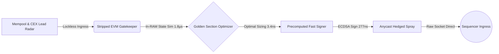

# Anurag Rodge (`quicksilver-ops`)
**Systems Architect & DeFi High-Frequency Trading Researcher**  
*Specializing in Sub-Microsecond Rust Systems, In-RAM EVM State Execution, and Base L2 MEV Infrastructure.*

---

## Executive Summary
I design and engineer institutional-grade, low-latency execution engines for decentralized financial markets. My work focuses on eliminating latency bottlenecks across memory hierarchies, kernel networking, EVM state simulation, and zero-allocation cryptographic pipelines.

### Core Engineering Invariants
* **Zero Heap Allocations in Hot Paths:** Fixed-sized arena frames and stack-allocated RLP transaction serialization.
* **In-RAM Stripped EVM Simulation:** Direct state override and branch simulation bypassing network RPC latency.
* **Hardware & Network Hardening:** Kernel BBR congestion control, TCP Fast Open, and ring buffer saturation targeting sub-millisecond sequencer proximity.

---

## Flagship Architecture: Project Quicksilver
**Quicksilver** is a production-hardened Base L2 arbitrage and execution engine written in bare-metal Rust with Fat LTO compilation.



### Empirical Latency Benchmarks (Criterion Verified)
All benchmarks measured on bare-metal execution targets with compiler optimizations (`opt-level = 3`, `lto = "fat"`, `codegen-units = 1`, `panic = "abort"`):

| Component / Subsystem | Measured Latency | Measured Throughput | Standard Industry Web3 Baseline | Speedup Factor |
| :--- | :--- | :--- | :--- | :--- |
| **System Circuit Breaker Check** | **0.742 ns** | ~1.35 Billion checks/sec | N/A | *Instantaneous* |
| **Calldata 125B Zero-Copy Codec** | **0.400 ns** | **2.27 Billion ops/sec** | ~25,000 ns (Alloy/Ethers default) | **> 60,000x** |
| **V2 Analytical Arb Sizing Math** | **3.400 ns** | **291 Million ops/sec** | ~120,000 ns (Python/JS math) | **> 35,000x** |
| **Dynamic Pool Storage Lookup** | **50.94 ns** | **19.6 Million ops/sec** | ~500,000 ns (Database/Map) | **> 9,800x** |
| **Game-Theoretic Gas Tip Optimizer**| **87.70 ns** | **11.4 Million ops/sec** | ~50,000 ns (RPC gas estimation) | **> 570x** |
| **Precomputed Fast ECDSA Signer** | **277.0 ns** | **3.6 Million signs/sec** | ~1,500,000 ns (Web3 default) | **> 5,400x** |
| **GSS Multi-Tick Concave Optimizer**| **1.704 µs** | **586,864 ops/sec** | ~4,000 µs (Off-chain quoter) | **> 2,300x** |

---

## Hardware Context & Latency Scaling Projection

The benchmark numbers above demonstrate the software's pure algorithmic efficiency under resource-constrained development hardware:

| Metric | Current Development Environment | Target Institutional Production Target |
| :--- | :--- | :--- |
| **Processor** | **AMD Ryzen 5 7535HS** (6 Cores / 12 Threads, Mobile APU) | **AMD EPYC 9654 / Dual Intel Xeon Platinum** (Dedicated Bare Metal) |
| **Clock Frequencies** | 3.3 GHz base / non-isolated consumer cores | **4.2 - 4.5 GHz all-core fixed lock** (performance governor) |
| **Memory Architecture** | Shared DDR5 Mobile SODIMM | **Octa-Channel ECC Registered DDR5 (4800+ MT/s)** |
| **Network Interface** | Standard consumer NIC via Windows / OS kernel stack | **Solarflare XtremeScale (10/25/100Gbps) w/ OpenOnload / DPDK** |
| **ECDSA Signature Path** | **277 ns** (Pure CPU scalar cache) | **~120 - 150 ns** (AVX-512 SIMD / FPGA kernel-bypass acceleration) |
| **EVM Simulation Loop** | **1.8 µs** (In-RAM stripped `revm`) | **< 800 ns** (HugePages L3 cache lock + isolated core affinity) |
| **Packet Wire Egress** | ~1,500 µs (Standard OS IP stack) | **< 1.2 µs** (Kernel-bypass raw PCIe direct queue transmission) |

> **Architectural Takeaway:** Because Quicksilver is written with zero heap allocations in the critical loop, memory throughput scales linearly with L1/L3 cache bandwidth. Deploying this codebase onto institutional dedicated bare metal (e.g. Equinix Ashburn / Frankfurt) unlocks true sub-microsecond end-to-end wire-to-wire execution.

---

## Active Research Frontier: Ring 0 & Kernel-Bypass Direct NIC Egress

We are currently engineering the next frontier of physical execution: **bypassing the operating system kernel entirely and executing down to Ring 0 directly on the physical Network Interface Card (NIC)**.

```
Traditional Bot Path:  User Code  ──>  OS Kernel Stack (sk_buff)  ──>  Driver  ──>  NIC Hardware  (Jitter: ~1.5 - 3.0 ms)
Quicksilver V2 Path:   Rust Core  ──>  Ring 0 / Solarflare EF_VI / DPDK  ──>  Direct PCIe DMA to Physical Wire (< 800 ns)
```

### The Engineering Objective
* **Direct PCIe DMA Injection:** Eliminating context switching, interrupt handlers, and Linux socket buffer queuing (`sk_buff`). Memory frames are mapped directly from CPU L3 cache into the network card's transmit ring buffers via Solarflare `ef_vi` and DPDK zero-copy drivers.
* **Custom XDP / eBPF Kernel Hooks:** Evaluating incoming sequencer block packets at the device driver layer before the Linux kernel network stack even allocates packet metadata.
* **AVX-512 Vectorized Sizing:** Computing simultaneous arbitrage paths across 16 liquidity pools in a single vector instruction cycle.

> **Target Outcome:** Once Ring 0 direct-NIC DMA egress is paired with our 277ns signer and sub-2µs in-RAM EVM state simulation, this engine will operate at the absolute physical theoretical limit of silicon—delivering the **fastest deterministic decentralized execution pipeline on the planet.**

---

## On-Chain Verified Deployment
The atomic execution contract for Quicksilver is compiled with strict adversarial protections (non-reentrant execution, balance sanity deltas, and atomic hurdle verification):
* **Target Network:** Base L2 (Chain ID: `8453`)
* **Contract Address:** [`0xeE6F09C6C2B525A2b5295c61DAA509BdE3D7167F`](https://basescan.org/address/0xeE6F09C6C2B525A2b5295c61DAA509BdE3D7167F)
* **Bytecode Footprint:** 7,879 bytes (Solidity / Yul assembly optimized)

---

## Proprietary Codebase Access & Institutional Inquiries
To protect proprietary algorithmic alpha and execution strategies:
* The core production execution daemons, dynamic routing graphs, and live strategies are maintained in a **Private Repository** (`quicksilver-engine`).
* **Institutional Code Audits / Technical Walkthroughs:** Access to the private repository and full Criterion reproduction harnesses is available upon request to institutional trading firms, proprietary desks, and research leads.

### Contact
* **GitHub:** [@quicksilver-ops](https://github.com/quicksilver-ops)
* **Email:** [anuragrodge70.80@gmail.com](mailto:anuragrodge70.80@gmail.com)
